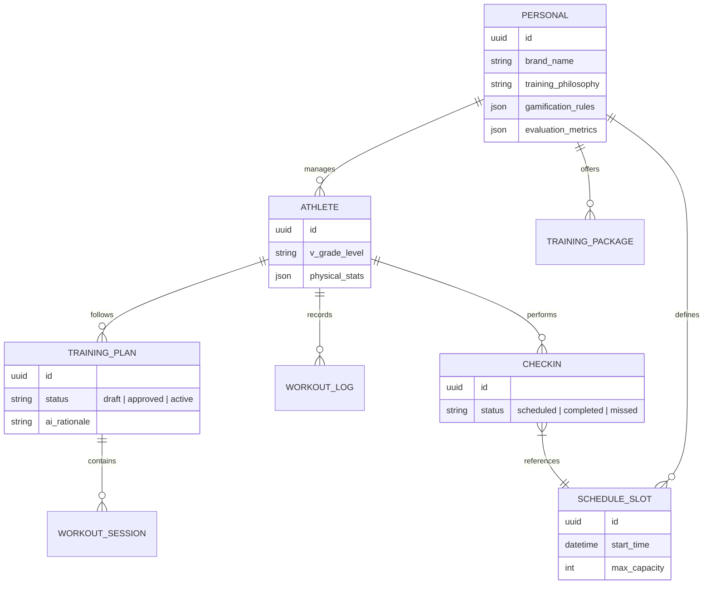

# Projeto Personal Climb

Este repositório contém a estrutura da plataforma **Personal Climb**, uma solução white-label inovadora para treinadores de escalada (Personals) gerenciarem seus alunos, prescreverem treinos com auxílio de IA e automatizarem seu branding e vendas.

---

## 1. Documentação Estratégica (Português)

### User Stories

#### Jornada do Personal (White-label)
1. **Configuração de Marca:** Como Personal, quero configurar meu Hotsite (nome, cores, bio, pacotes) via CMS para que eu tenha uma presença profissional online.
2. **Protocolo de Treino:** Como Personal, quero definir minha metodologia de treino e critérios de avaliação para que a IA gere sugestões alinhadas com minha filosofia.
3. **Gestão de Agenda:** Como Personal, quero disponibilizar meus horários para que meus alunos possam realizar o check-in e confirmar treinos presenciais ou remotos.
4. **Dashboard de Performance:** Como Personal, quero monitorar a evolução física e técnica de todos os meus alunos em um único painel.
5. **Aprovação de Treinos:** Como Personal, quero revisar e aprovar os treinos sugeridos pela IA para meus atletas, garantindo segurança e personalização final.

#### Jornada do Atleta
1. **Contratação:** Como atleta, quero acessar o Hotsite do meu Personal, ver seus pacotes e realizar a assinatura.
2. **Anamnese e Avaliação:** Como atleta, quero preencher meus dados e realizar testes físicos para que o Personal e a IA conheçam meu nível atual.
3. **Check-in de Treino:** Como atleta, quero marcar os dias e horários que irei treinar para coordenar com meu Personal.
4. **Evolução Gamificada:** Como atleta, quero ver meus atributos físicos evoluindo (estilo RPG) conforme registro meus treinos e avaliações.

---

### Esquema de Banco de Dados (ERD)

---

### Prompt de Sistema para IA de Prescrição

**Papel:** Você é o motor de IA da plataforma Personal Climb, atuando como um assistente técnico de alta performance para treinadores de escalada.

**Objetivo:** Gerar ciclos de treinamento personalizados baseados na **anamnese do atleta** e no **protocolo específico** definido pelo Personal.

**Instruções Críticas:**
1. **Filtro de Segurança:** Se houver histórico de lesões, priorize exercícios de baixo impacto e reabilitação. Jamais sugira treinos de alta intensidade (ex: Campus Board) para atletas com menos de 2 anos de prática consistente.
2. **Contexto de Equipamento:** Adapte o treino estritamente aos equipamentos disponíveis (MoonBoard, Hangboard, Muro Comercial, etc).
3. **Metodologia do Personal:** Respeite as "Regras de Ouro" do treinador (ex: "Sempre focar em mobilidade de ombros antes de treinos de potência").
4. **Feedback Loop:** Analise os logs de RPE (Percepção de Esforço) das sessões anteriores para ajustar o volume da semana seguinte.
5. **Formato de Saída:** Retorne estritamente um JSON estruturado com:
   - `analise_perfil`: Breve diagnóstico técnico.
   - `objetivo_mesociclo`: Foco principal do período.
   - `planejamento_semanal`: Lista de sessões com exercícios, séries, repetições, intensidade e tempos de descanso.

---

## 2. Estrutura Técnica e Fluxos de Uso

Este projeto utiliza uma arquitetura moderna e escalável, focada em performance, SEO e segurança Web3.

### Fluxos Principais (Implementação em curso)

0.  **Estratégia Híbrida de Dados:** Separação entre SQL (Dados sensíveis) e Sanity CMS (Conteúdo/UI). Veja [STORAGE_STRATEGY.md](./STORAGE_STRATEGY.md).
1.  **UC01: Seleção de Perfil (Onboarding):** Redirecionamento inteligente entre Aluno (White Label) e Personal (Business).
2.  **UC02: Autenticação Privy:** Login unificado via Social ou Wallet.
3.  **UC03/04: Gestão Financeira:** Integração com Stripe para assinaturas e cobrança baseada em uso (por atleta ativo).
4.  **UC05: White Label Dinâmico:** Carregamento de marca e treinos baseado no slug do personal.

### Componentes Técnicos
1. **Frontend (`/client`):** Next.js 15 (App Router) + Tailwind CSS.
   - **Autenticação:** Privy.io.
   - **Hospedagem:** GitHub Pages (Exportação Estática).
2. **Backend (`/server`):** Hono API + Drizzle ORM.
   - **Banco de Dados:** PostgreSQL (Supabase/Neon).
   - **Pagamentos:** Stripe (Usage-based billing).
   - **Hospedagem:** Vercel (Edge Functions).
3. **CMS (`/studio`):** Sanity.io para gestão de conteúdo white-label.

### CI/CD (GitHub Actions)
- `.github/workflows/deploy-frontend.yml`: Build e deploy automático para GitHub Pages.
- `.github/workflows/deploy-backend.yml`: Deploy automático para Vercel.

---
*Documentação gerada por Jules - Soluções Personal Climb.*
